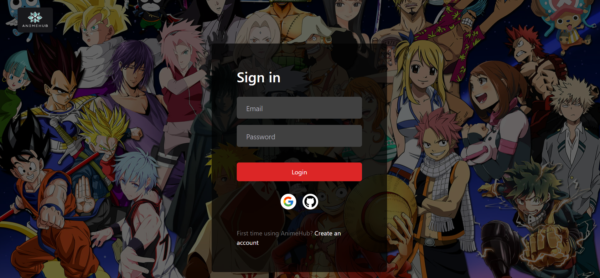
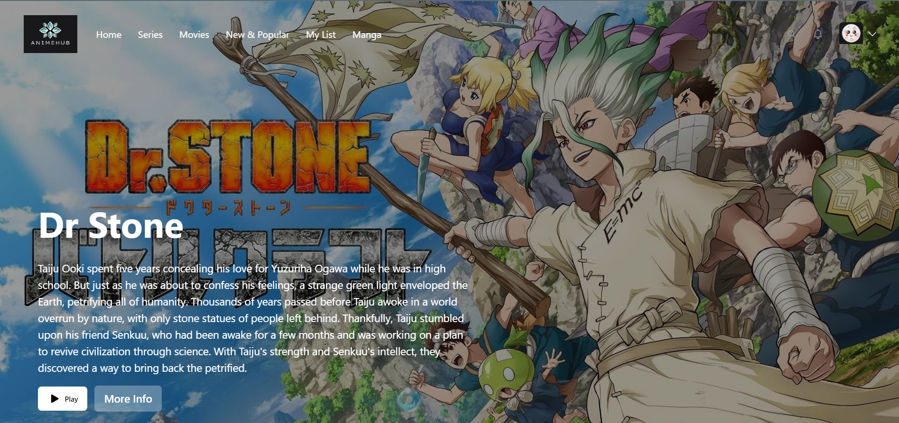
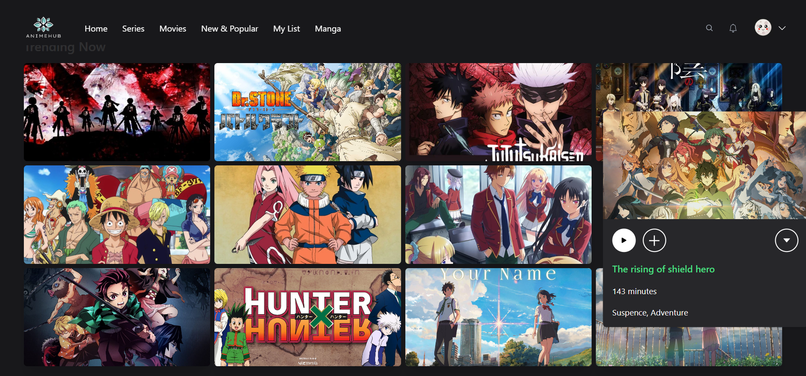
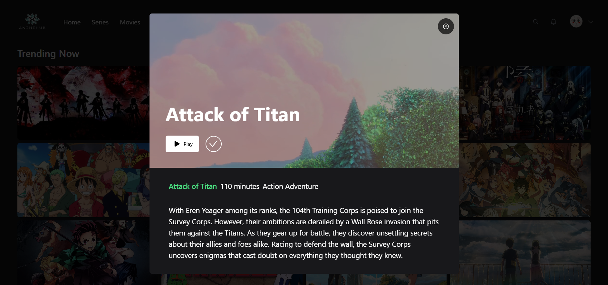

# AnimeHub

Anime Hub is your one-stop destination for all things anime. Dive into a world of captivating stories, exciting adventures, and colorful characters. It offers a massive library of your favorite anime series and movies.






### Cloning the repository

```shell
git clone https://github.com/Diveshmahajan4/AnimeHub.git
```

### Install packages

```shell
npm install
```

### Setup .env file

```js
DATABASE_URL=
GOOGLE_CLIENT_ID=
GOOGLE_CLIENT_SECRET=
GITHUB_ID=
GITHUB_SECRET=
NEXTAUTH_JWT_SECRET=
NEXTAUTH_SECRET=
```

### Start the app

```shell
npm run dev
```
